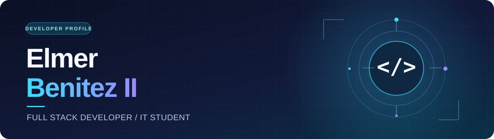

<!--
  Profile README for Elmer Benitez II
  Keep assets/profile-header.svg beside this file when publishing the README.
  The contribution snake is generated daily for the GitHub account redd1514.
  Update the technology badges as your toolkit evolves.
-->

  

  

  

    
    
    
  

  <a href="#about-me">About me</a> &nbsp;·&nbsp;
  <a href="#current-focus">Current focus</a> &nbsp;·&nbsp;
  <a href="#tech-stack">Tech stack</a> &nbsp;·&nbsp;
  <a href="#github-at-a-glance">GitHub stats</a> &nbsp;·&nbsp;
  <a href="#contribution-snake">Contribution snake</a> &nbsp;·&nbsp;
  <a href="#connect-with-me">Connect</a>

---

## About me

I’m **Elmer Benitez II**, a graduating Information Technology student at **Pamantasan ng Lungsod ng Valenzuela** with a passion for full-stack development and modern technology.

I enjoy turning ideas into practical, user-focused solutions, learning how things work under the hood, and continuously improving the way I build software.

> **My approach:** learn continuously, build intentionally, and create technology that solves real problems.

<a href="https://reddbenitez.vercel.app/">Explore my portfolio &rarr;</a>

## Current focus

<table>
  <tr>
    <td width="33%" align="center">01 / BUILD <strong>Build</strong> Creating solutions for real-world problems</td>
    <td width="33%" align="center">02 / EXPLORE <strong>Explore</strong> Learning new technologies, frameworks, and generative AI</td>
    <td width="33%" align="center">03 / IMPROVE <strong>Improve</strong> Advancing my full-stack development skills</td>
  </tr>
</table>

## Tech stack

<!-- Edit or remove any badge that does not reflect your current toolkit. -->

### Programming languages

  
  
  
  
  
  
  

### Frameworks & libraries

  
  
  
  
  

### Game development

  
  

### Databases

  
  
  
  

### Cloud & deployment

  
  
  
  

### Tools & DevOps

  
  
  
  
  

## GitHub at a glance

  
  

  

## Contribution snake

  <picture>
    <source media="(prefers-color-scheme: dark)" srcset="https://raw.githubusercontent.com/redd1514/redd1514/output/snake-dark.svg" />
    <source media="(prefers-color-scheme: light)" srcset="https://raw.githubusercontent.com/redd1514/redd1514/output/snake.svg" />
    
  </picture>

## A little more about me

  
<strong>Click to open</strong>

   

  - I’m building practical projects and sharpening my full-stack workflow.
  - I’m exploring modern frameworks, new developer tools, and generative AI.
  - I’m interested in game development and interactive digital experiences.
  - I enjoy learning in public, collaborating, and turning challenges into useful products.
  - Ask me about full-stack development, web technologies, or ideas for solving real-world problems.

## Connect with me

  
  

 

  <i>Thanks for stopping by — let’s build something meaningful.</i>

